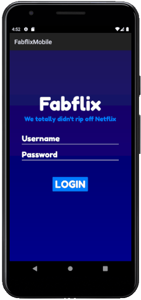

# Fabflix - Android Application

  

The Fabflix course (AKA CS 122B) is a challenging capstone project course at UC Irvine where students form groups of 2 to build and deploy a scalable, full-stack web application for searching, browsing, and interacting with movie data stored in a SQL database, as well as an Android application that mirrors the website's core functionality.

The user interface and back-end of the native Android application was designed and implemented independently by consuming, modeling, serializing, parsing, and displaying movie data from custom REST APIs that were jointly developed and deployed on an AWS EC2 instance.

Due to UC Irvine's policies preventing project plagarism, the code for this project is availble upon request (Please email michaellofton001@gmail.com).
